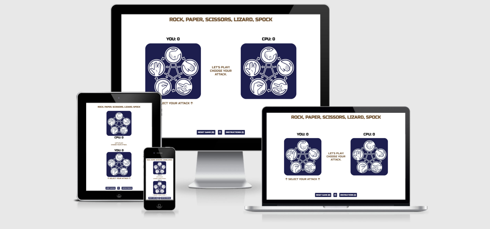
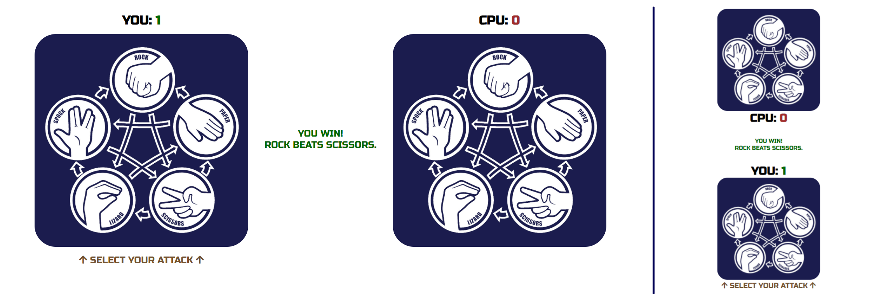
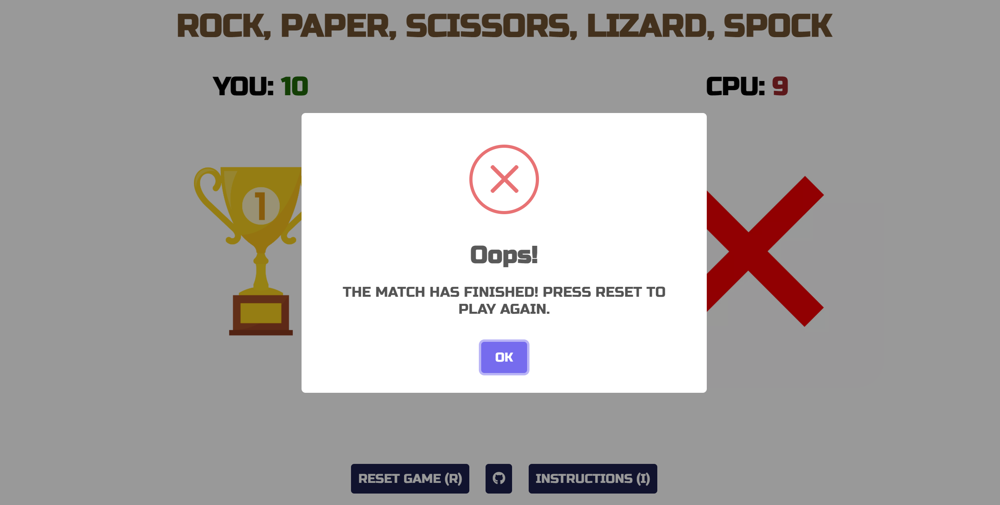

# Rock, Paper, Scissors, Lizard, Spock

## Site Overview
Challenge your luck against the computer in a contemporary variation of the traditional game of chance. This interactive front-end game introduces two additional variables - Lizard and Spock - adding complexity to both the rules and gameplay. However, the extra combinations of the game are displayed intuitively, as players select their attack directly from the winner hierarchy figure, removing the need to be fluent in the combination outcomes.
 
A countdown sequence triggers every time a selection is made, building anticipation before the winner of the point is revealed. The winner and loser are easily discerned through colour coding of the scores and the result message. Do you have what it takes to take on the computer?

## Contents
1. [Site Overview](#site-overview)
1. [Planning](#planning)
    * [Target Audience](#target-audience)
    * [User Stories](#user-stories)
    * [Styling](#styling)
1. [Features](#features)
    * [Navigation](#navigation)
1. [Future Enhancements](#future-enhancements)
1. [Technology Used](#technology-used)
1. [Testing](#testing)
    * [Functionality Testing](#functionality-testing)
    * [Compatibility Testing](#compatibility-testing)
    * [Performance Testing](#performance-testing)
    * [Validator Testing](#validator-testing)
    * [Bugs](#bugs)
    * [Unfixed Bugs](#unfixed-bugs)
1. [Deployment](#deployment)
    * [GitHub Pages](#github-pages)
    * [Cloning Repository](#cloning-repository)
1. [Credits](#credits)
    * [Content](#content)
    * [Media](#media)

## Planning
### Target Audience
* Users who wish to engage in a more complex version of Rock, Paper, Scissors.
* Users who are looking to design and code interactive games themselves.
* Younger users who are looking to play a simple, engaging game with a short duration.
* Users who are looking to interactively learn the rules of Rock, Paper, Scissors, Lizard, Spock to play externally with friends.

### User Stories
* As a user, I want a simple, clean layout, providing everything I need for smooth gameplay.
* As a user, I want to easily access instructions on how to play the game.
* As a user, I want to easily select my chosen attack in an intuitive manner.
* As a user, I want to easily view the winner of each point and receive an explanation of the result.
* As a user, I want to easily reset the game to play again as many times as desired.

### Wireframes
* Wireframes were created to plan the visual layout of the site, organise the content into sections and plan the structure for both desktop and mobile browsers.  To optimise the usage of space, the content spanned horizontally on wide screens, and stacked vertically on thinner screens.

### Styling
* The website font was chosen to mimic the font in the main selection image and to provide strong, bold text for the users to read. The 'Russo One' font was chosen and imported from [Google Fonts](https://fonts.google.com/specimen/Russo+One/).
* The site's main colours of black, white and navy blue and dark beige were chosen as a stonewashed pallet.
* A colour grid was created to evaluate appropriate colour pairings using the [Eight Shapes Color Grid](https://contrast-grid.eightshapes.com/?version=1.1.0&background-colors=&foreground-colors=%23ffffff%0D%0A%23000000%0D%0A%231b1d4e%0D%0A%2374522F%0D%0A%23A12B2B%0D%0A%23006100&es-color-form__tile-size=compact&es-color-form__show-contrast=aaa&es-color-form__show-contrast=aa&es-color-form__show-contrast=aa18&es-color-form__show-contrast=dnp). The left column shows that the all colours have an AAA contrast ratio of at least 7 over white backgrounds for excellent legibility.
* The dark beige colour was used to accentuate titles and key information, and to break away from the main navy blue theme colour.
* The shades of red and green were chosen with sufficient contrast on a white background, while providing enough intensity to quickly distinguish the winner and loser.
* From this it was decided that all fonts would be kept black upon either white or golden background colours in order to provide sufficient contrast for the users. The inversion was also used to highlight active classes or upon hovering over elements.

## Features
### Instruction Page
Upon loading the page, the user is provided with instructions of how to play the game, including the winner hierarchy figure and the different methods to select their attack. Users can return to this page throughout the game without losing their progress by clicking on the instruction button or "I" on their keyboard.

### Game Area
The game area consists of two player areas - the user and the computer - containing their current score, and their current active image. Images vary dynamically between the attack selection figure, the player's chosen attack, and finally the winner/loser images after the game finishes.

### Responsive Layout
For wider screens, the user and computer game areas are side by side to optimally fill the window area. For thinner screens, such as mobiles and tablets, the player areas are stacked vertically, giving the user the sense of playing directly in front of their opponent. CSS media queries were utilised to optimise the styling across the different screen sizes.

### Integrated Attack Selection
The user selects their attack by clicking directly on the relevant icon in the image. Circular buttons are embedded over the each attack option so the user can intuitively relate their selection to the other possible attacks.

### Countdown Sequence
After the user selects and attack, a countdown sequence is triggered. The words "Rock", "Paper", "Scissors", "Lizard", "Spock" flash in the center of the screen before returning the outcome of the point. This creates anticipation over the result after the user locks in their selection. All selector buttons are disabled for the duration of the countdown to prevent the result from being overridden or from sending unaccepted inputs through the code.

### Outcome Feedback 
The last evaluated result is verbally transcribed in the central area, stating whether the user won/lost/drew and providing an explanation of the combination behind the scoring. The winner and loser's scores are displayed in green and red respectively to provide an instant visual indicator of the victor. Additionally, the result text is responsively coloured in accordance with the user's outcome.

### Declaring the Winner
Once either player reaches 10 points the winner is declared, returning a trophy image to the victor's game area and a red cross to the loser's game area. All selector buttons are prevented from triggering from this point onwards, until the user selects to reset the game and play again. Should a selector be pressed, a Sweet Alert message will appear to reiterate this to the user.

### Error Catching
Once the game has ended, the user can reset the game to play again. All selector buttons are disabled from triggering the game sequence, however, should the user select another attack at this point, a Sweet Alert error message informs the user that they must reset the game to continue playing.

## Future Enhancements
Various additional features would bring a greater user experience to the website: 
* The addition of a two-player game, where two users can play against each other.
* The addition of customisable winning score - e.g. first to 20, best of 15 etc.

## Technology Used
* HTML - Creating and adding content
* CSS - Styling content
* JavaScript - Manipulating content
* [Google Fonts](https://fonts.google.com/specimen/Russo+One/) - 'Russo One' style 
* [Font Awesome](https://fontawesome.com/v5.15/icons/) - GitHub and up-arrow icons
* [GitPod](https://www.gitpod.io/) - IDE for local development
* [GIT](https://git-scm.com/) - Version Control
* [GitHub](https://github.com/) - to host the repositories for this project and the live website preview

## Testing
### Functionality Testing
* **Test** - All buttons were clicked to check they performed the desired outcome.
    * **Outcome** - All 5 attack selector buttons sent the appropriate data-type attribute when clicked, triggering the correct event listener code. The 'Reset Game' button correctly executed the resetBoard() function, the 'Instructions' button overlayed the instructions content, and the 'Play' button resumed the game from the last recorded since (0-0 upon loading). The GitHub button previously contained an anchor tag linking to the GitHub page, though the user was only redirected when clicking on the text, and the button body triggered an unknown data-type issue in the event listener logic. Consequently, the anchor tag was removed and the user was redirected to the site via JavaScript when clicking on any part of the button. 

* **Test** - Checked all keyboard shortcut commands operated correctly, 
    * **Outcome** - Pressing the 1-5 keys on the keyboards correctly triggered the attacks from rock through to spock respectively. Pressing the 'R', 'I' and 'P' keys on the keyboard executed the same code as the 'Reset Game', 'Instructions' and 'Play' buttons respectively, as explained above.

* **Test** - All images on the website displayed correctly.
    * **Outcome** - All user attacks were selected to check that the correct images were displayed in the user area upon revealing the result. This was also checked for the computer's selection by ensuring the returned image matched the output of <code>console.log(cpuSelection)</code>. Similarly, the images for the winner and loser of the game were checked using <code>console.log(victor))</code> within the <code>declareWinner()</code> function. It was also verified that the main selection was re-displayed after 3 seconds of revealing the result for all attack options.

* **Test** - Testing errors were caught correctly.
    * **Outcome** - After the winner was declared, all the selector buttons and 1-5 keys were pressed to check if the countdown sequence was triggered. For all cases the Sweet Alert function intervened to inform the user to reset the game to continue playing, ensuring that the user could not continuously play the game with no end.

* **Test** - Checking the score bar for the computer moved below the image on smaller screens.
    * **Outcome** - <code>console.log('threshold crossed')</code> was used to check that the  <code>moveScore()</code> function was executing correctly. This message is displayed in the console every time the window size crossed the stacking threshold of 800px. The window was dragged to small and large widths several times, and the score bar moved appropriately to optimise the viewing of the content.

### Compatibility Testing
* **Test** - Testing responsivity across various screen sizes.
    * **Outcome** - The website was tested for responsivity across screen sizes of 320px, 768px, 1280px and 1600px in width, coving typical screens for mobiles, tablets, laptops and desktops. Three different laptop sizes and three different mobile phone sizes were used to verify this. Content readability was optimised by altering the size and positioning of elements.

* **Test** - Testing across multiple browsers.
    * **Outcome** - The Developer Tools function was used to test this across Google Chrome, Mozilla Firefox and Microsoft Edge to verify the site was fully responsive across the specified screen widths and across different browsers.

* **Test** - Continuous verification across multiple viewports.
    * **Outcome** - [Am I Responsive](http://ami.responsivedesign.is/#) was frequently used to check the responsiveness of the website across different screen dimensions, ensuring that all content was displayed in the optimal manner.

### Performance Testing
* **Test** - Numerically testing the effectiveness of the website.
    * **Outcome** - The Lighthouse function in Google Chrome's Developer Tools was used frequently to numerically measure the parameters such as performance, accessibility, best practices and search engine optimisation. Lighthouse was run for both desktop and mobile sites with the results shown below.
    #### Desktop Homepage Lighthouse Results
    
    #### Mobile Homepage Lighthouse Results
    

* **Test** - Checking performance of images loading.
    * **Outcome** - The website was designed using a desktop-first approach, therefore the image resolutions were optimised to look better on larger screens. This resulted in a lower performance score due to longer contentful paint times on mobile devices as the image resolution was much larger than the maximum screen resolution.
    * **Outcome 2** - Lighthouse returned a warning indicating that no explicit width or height was provided. To resolve this, the attributes of <code>width="500" height="500"</code> were added to the three image elements in the HTML script, and <code>img {height: auto;}</code> was added in the CSS script. This meant that the aspect ratio of the images was not overridden by the default settings of the browser and thus the image data could be manipulated faster at the start of the layout calculation through the provision of this code. Image sizes could subsequently be overridden using typical CSS code. [Adapted from web.dev](https://web.dev/optimize-cls/?utm_source=lighthouse&utm_medium=devtools#images-without-dimensions/).

* **Test** - Testing performance of importing Sweet Alert scripts 
    * **Outcome** - The performance of the website was significantly improved by importing the sweetalert2 JavaScript file script from the web URL <code>https://unpkg.com/sweetalert/dist/sweetalert.min.js</code> rather than from the JSDelivr CDN <code>//cdn.jsdelivr.net/npm/sweetalert2@11</code>. This halved the largest contentful paint time, which particularly improved the loading time on mobile devices.

* **Test** - Testing performance of importing Google Fonts scripts 
    * **Outcome** - The performance of the website was significantly improved by importing the 'Russo One' Google Font from within the CSS script rather than from the within the head of the HTML script. This again halved the largest contentful paint time, which particularly improved the loading time on mobile devices.

### Validator Testing
#### HTML
* No errors were found when running the HTML code through the [official W3C validator](https://validator.w3.org/).
#### CSS
* No errors were found when running the CSS code through the [official W3C Jigsaw validator](https://jigsaw.w3.org/css-validator/).
#### JavaScript
* No errors were found when running the JavaScript code through the [JSHint validator](https://jshint.com/).
#### Accessibility
* The website was tested using the Lighthouse function in Chrome DevTools, showing a accessibility level of 100%.
    
### Bugs
* **Issue** - Generating the winner outcome.
    * **Resolution** - A standardised outcome array was set up for each selection option with the syntax <code>selectionArray = [win, win, lose, lose, draw]</code>, representing the user's outcome relative to the computer's selection. For example <code>rockArray = ['scissors', 'lizard', 'paper', 'spock', 'rock']</code>, where rock beats scissors, loses to paper and so forth. Subsequently, each selection array was nested within the larger <code>cases</code> array, creating one variable from which all combinations could be accessed. This meant that <code>cases[i][j]</code> could be used to create the outcome logic for any combination, where i represented the user's selection, j represented the computer's selection, and the j index determined the user's outcome (win, lose, draw). No tutorials were used when writing the code to determine the winner.

* **Issue** - Embedding selection buttons within the attack options in the image.
    * **Resolution** - Instead of using conventional buttons, absolute positioning was used to position the selector buttons accordingly within the encasing image container div. This meant the user could click on the icon of their attack, rather than from an external point outside of the image. Additionally, positioning using percentages ensured the button orientation was constant across different screen sizes. [Adapted from Stack Overflow](https://stackoverflow.com/questions/24435397/click-particular-region-of-image).

* **Issue** - Creating a countdown feature before revealing the result.
    * **Resolution** - The <code>setTimeout()</code> timing event was used to dynamically cycle through the countdown procedure. The <code>countdown()</code> function contained another <code>setTimeout()</code> that self-referenced the <code>countdown()</code> function, creating a loop of nested time events. The loop was broken using if-statement logic after the countdown iterations were complete. [Adapted from Carl Anderson](https://carlanderson.xyz/creating-timed-sequences-in-javascript-using-settimeout/).

* **Issue** - Capability for selector buttons to be pressed before the countdown sequence was finished.
    * **Resolution** - The <code>buttonIncomplete</code> was initialised to false and was updated to true upon the user selecting an attack. While <code>buttonIncomplete</code> was true, no other attack options could be selected. Once the winner of the point had been declared, it was reassigned back to false and another option could be chosen. Similarly, once either player reached 10 points a Sweet Alert appears to inform the user to reset the game, and the selectors would not initiate the countdown sequence.

* **Issue** - Dynamically hiding elements from view during gameplay.
    * **Resolution** - Main games area were assigned and unassigned the .hide class using JavaScript depending on whether they were active or not. Applying <code>display:none</code> allowed for the element to be hidden from view and also occupy no space on the screen. A separate .hide-visible class was applied to elements in the center area such as the result and countdown text. This instead applied <code>visibility:hidden</code> to hide the content from view while keeping the structural integrity of the HTML. [Adapted from Career Karma](https://careerkarma.com/blog/css-hide-element/).

* **Issue** - Functions running immediately when assigning event listeners.
    * **Resolution** - The syntax of the listener was assigned to <code>() => functionName(variable))</code> instead of simply <code>functionName(variable)</code>. If no variables were passed into the function, passing only <code>functionName</code> prevented the immediate running of the function. [Adapted from Stack Overflow](https://stackoverflow.com/questions/16310423/addeventlistener-calls-the-function-without-me-even-asking-it-to).
    
* **Issue** - Alerts disturbing the flow of events.
    * **Resolution** - Since the browser was forced to read <code>alert()</code> commands immediately, preceding code which had not been fully executed was stalled. For example the declaration of the winner stalled the rendering of images. The integration of sweetalert2 enabled alerts to be displayed dynamically without forcing all other code to stop. [Adapted from Sweet Alert](https://sweetalert2.github.io/).

* **Issue** - Resetting the board after each outcome was declared.
    * **Resolution** - To keep a fast paced flow to the game, after declaring the winner of each point the images of each player's attack were shown for two seconds before returning to the selection image. The <code>setTimeout()</code>, meaning the user did not need to press a button to acknowledge the result. The result text, however, remained unchanged in the center, should the player have missed the combination from the images.

* **Issue** - Moving score locations when vertically stacking player areas.
    * **Resolution** - For the horizontal orientation on larger screens, both players' scores are above their game image. However, when stacking vertically, this meant that the scores were not in close proximity and the user needed to actively seek out each score individually. Therefore, the simple <code>stackScore()</code> function was created to rearrange the computer's score below the image, having both score in the central region. This was triggered by the screen size crossing below the threshold for vertical stacking (800px) and reset to the default above the threshold. 

### Unfixed Bugs
There are no known bugs left unfixed.

## Deployment
### GitHub Pages
The site was deployed to GitHub pages. The steps to deploy are as follows:
1. In the GitHub repository, navigate to the repository for apprentice-brewing and then click on the Settings tab.
1. Click on the Pages tab from the list of options on the left hand side of the page.
1. Under Source click the drop-down menu labelled None and select main as the branch.
1. Once saved the link to the page will be provided above the ‘Source’ sub-section upon refreshing.
1. The live link can be found here - https://bens6477.github.io/rock-paper-scissors-lizard-spock/

### Cloning Repository
You can clone this repository to view, edit and run the code. The steps to clone the repository are as follows:

* Within the repository, navigate to the 'Code' drop-down menu, select 'HTTP' and copy the URL.
* Open Git Bash from your IDE of choice.
* Navigate the current working directory to your desired location.
* To clone the repository, type <code>git clone</code> into the terminal followed by the repository URL, in this case <code>git clone https://github.com/bens6477/rock-paper-scissors-lizard-spock</code>.
* Press 'Enter'.

## Credits
### Content
* Providing explicit width and height dimension to images - adapted from [web.dev](https://web.dev/optimize-cls/?utm_source=lighthouse&utm_medium=devtools#images-without-dimensions/)
* Embedding selection buttons within the attack options in the image -  adapted from [Stack Overflow](https://stackoverflow.com/questions/24435397/).
* Creating a countdown feature before revealing the result - adapted from [Carl Anderson](https://carlanderson.xyz/creating-timed-sequences-in-javascript-using-settimeout/).
* Dynamically hiding elements from view during gameplay - adapted from [Career Karma](https://careerkarma.com/blog/css-hide-element/).
* Functions running immediately when assigning event listeners - adapted from [Stack Overflow](https://stackoverflow.com/questions/16310423/addeventlistener-calls-the-function-without-me-even-asking-it-to).
* Alerts disturbing the flow of events - adapted from [Sweet Alert](https://sweetalert2.github.io/).
* In-context code credits are provided in the [Bugs](#bugs) section.
* All fonts were imported from [Google Fonts](https://fonts.google.com/specimen/Russo+One/).
* The icons in the footer and game area were taken from [Font Awesome](https://fontawesome.com/v5.15/icons/).

### Media
* The main figure with attacks was taken from the images in this eBay [T-Shirt](https://www.ebay.co.uk/itm/273532646173). Each individual attack image was cropped from the parent image above.
* The trophy winner image was taken from [freepik](https://www.freepik.com/vectors/business).
* The red cross loser image was taken from [Wikimedia](https://upload.wikimedia.org/wikipedia/commons/thumb/5/5f/Red_X.svg/1024px-Red_X.svg.png).
The image displaying the website on different screens in this document was created using [Am I Responsive](http://ami.responsivedesign.is/#).
* Wireframes were created using [Balsamiq](https://balsamiq.com/).